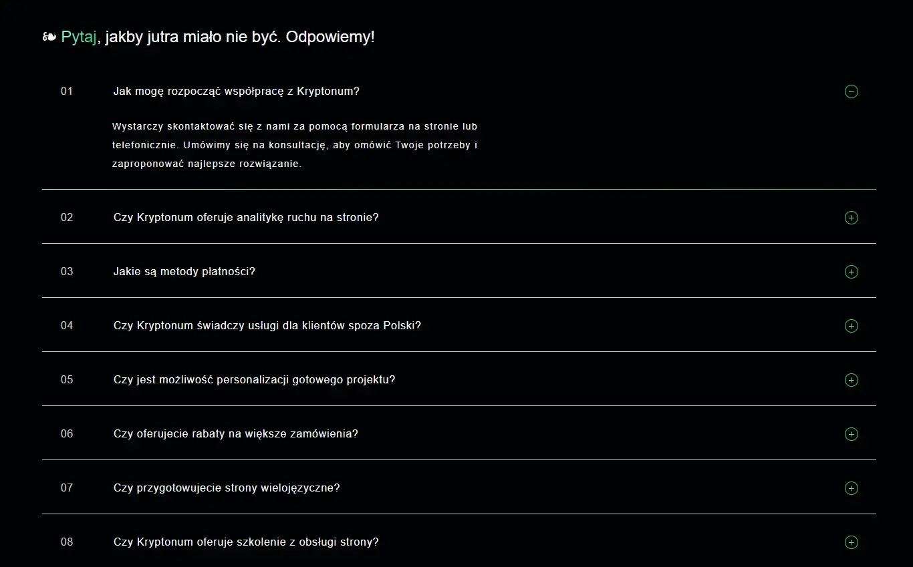
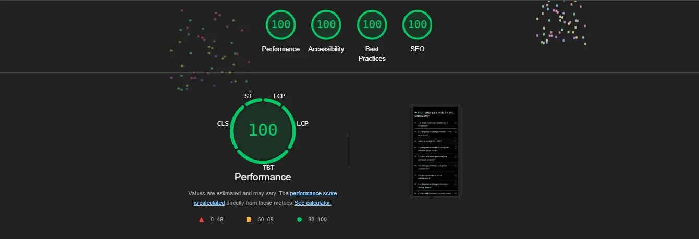
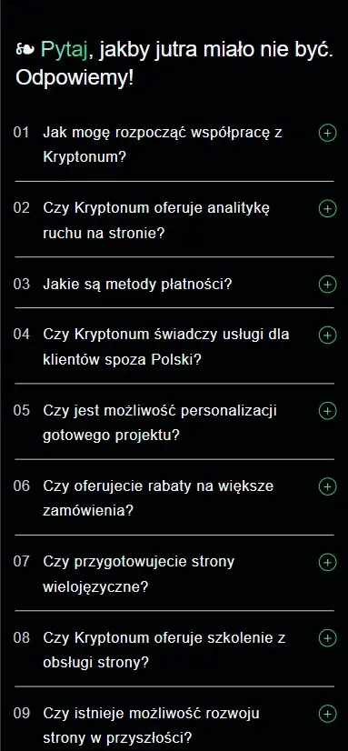
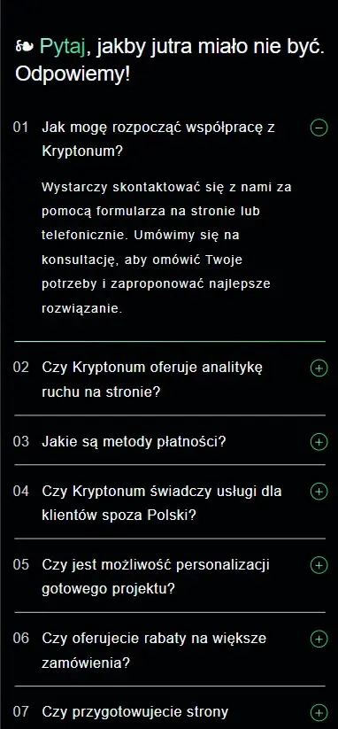
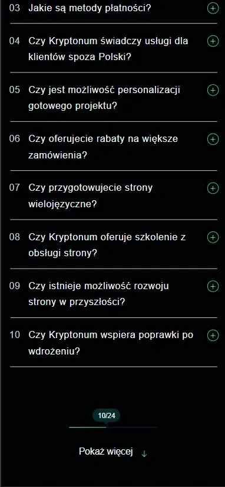
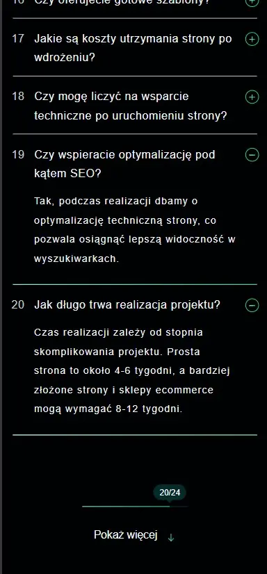
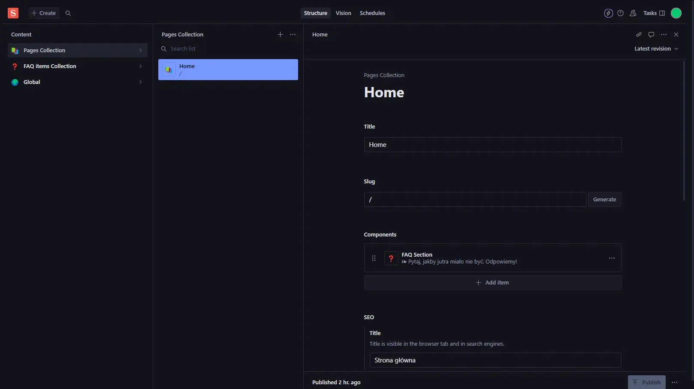
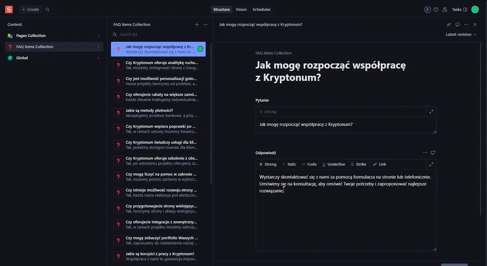

# Accordion Component for [Kryptonum Software house](https://kryptonum.eu/pl) Dev Task

#### Live version [here](https://accordion-lilac-omega.vercel.app/)



<br />

## How to run the project locally on Windows with npm:

Clone the repository

```bash
git clone https://github.com/rafal19987/accordion.git
```

Navigate to the folder

```bash
cd accordion
```

Install dependencies

```bash
npm install
```

Create .env file in root folder and create there variables from .env.EXAMPLE file

Start the development environment

```bash
npm run dev
```

Go to http://localhost:3000/

<br />

## Description:

The task was to recreate an accordion component based on a Figma mockup. Initially, I started creating a project based on a template created by programmer [Bogumił Milewski](https://github.com/milewskibogumil), who created the [Astro-Sanity-Starter](https://github.com/milewskibogumil/astro-sanity-starter) integration based on turborepo and bun. Unfortunately, I encountered a bug on Windows 11 that caused the bun to be changed to npm. The bug is described [here](https://github.com/getcursor/cursor/issues/1007).

A big inspiration was also the [accordion component created by the same developer](https://github.com/kryptonum-dev/kryptonum-eu/blob/main/apps/astro/src/components/ui/Accordion.astro). During the development I found that the code borrowed too much from Bogumił's work, which I didn't feel comfortable with. So I decided to slightly change the implementation of the Sanity integration based on Next.js, also replacing scss with Tailwind, to add some freshness, drawing a lot of inspiration from the naming convention of elements and the schema structure for Sanity components.

In this way, instead of copying a large part of someone else's work, I wanted to demonstrate to everyone my actual skills and mindset of how I would approach the task, rather than working in a fully prepared environment. Mea Culpa

<br />

## Techstack:

- [Next.js](https://nextjs.org/)
- [Tailwind](https://tailwindcss.com/)
- [Typescript](https://www.typescriptlang.org/)

#### Tools

- [Eslint](https://eslint.org/)
- [Tailwind Typography Plugin](https://v1.tailwindcss.com/docs/typography-plugin)
- [Sanity CMS](https://www.sanity.io/)

#### Deployment

- [Vercel](https://vercel.com/)

<br />

## Functionalities:

- [x] Creating an accordion component
- [x] Button that loads more questions with answers than the initial 10
- [x] Accessibility using the details and summary tags
- [x] Animated indicator informing about opening or closing details
- [x] Animated gradient effect as border for expanded details
- [x] Progressbar informing to what extent we have discovered all the questions with answers
- [x] Connecting full site management via Sanity CMS
- [x] Styling the entire site with Tailwind
- [x] Using Tailwind Typography for content with prose
- [x] Static typing with typescript
- [x] Responsiveness for different screens
- [x] Creating a sitemap and robots file
- [x] Lighthouse score 100% for desktop and mobile

<br />

## ScreenShots:













